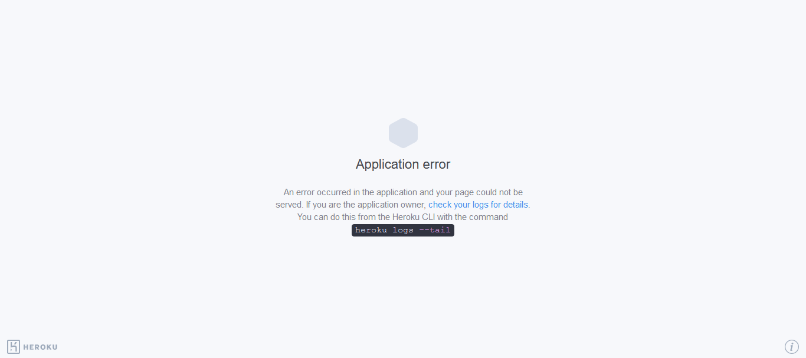

# Iris classification
  

This project can be used to classify the Iris species according to the given Sepal and Petal dimension.
This model uses KNeighourClassifier to predict the ouput on given input.
This task is done for The GRIP foundation as an intern in Data Science and Business Analytics in April 2021.
 This repository consists of files required to deploy a ___Machine Learning Web App___ created with ___Flask___ on ___Heroku___ platform.

• If you want to view the deployed model, click on the following link:<br />
Deployed at: _https://iris-classification-knn.herokuapp.com/_


Alternatively, you can deploy your own copy of the app using this button:

[](https://heroku.com/deploy)

Here is the classification of different Iris flower species.


Run this project locally
  Clone the repository and run it on Conda Environment with command 
  ```Python
  python app.py
  ```
   Copy the generated localhost URL and paste in browser.

_**----- Important Note -----**_<br />
• If you encounter this webapp as shown in the picture given below, it is occuring just because **free dynos for this particular month provided by Heroku have been completely used.** _You can access the webpage on 1st of the next month._<br />
• Sorry for the inconvenience.


